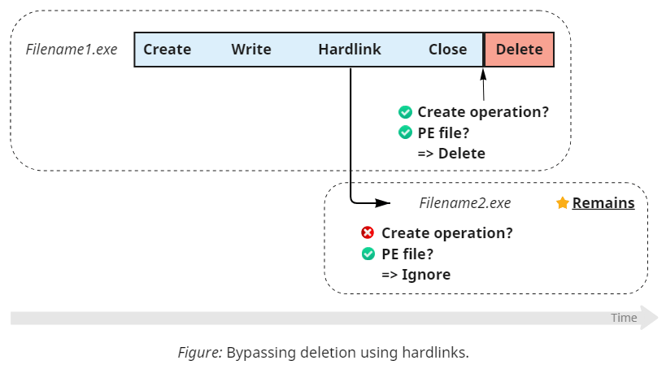

# Bypassing FileBlockExecutable in Sysmon 14.0: A Lesson In Analyzing Assumptions

## The New Capability

Recently (in August of 2022), the Sysinternals team released [**Sysmon 14.0**](https://docs.microsoft.com/en-us/sysinternals/downloads/sysmon) – a notable update of a powerful and configurable tool for monitoring Windows machines. While Sysmon already included a few valuable detection capabilities, the update introduced the first preventive measure – the **FileBlockExecutable** event (ID 27). This functionality targets malware that uses multi-stage deployment that drops executable files on disk. Sysmon detects, logs, and *automatically deletes* such files whenever they satisfy certain conditions. As with other events, the monitoring supports both white- and blacklisting modes and can take several criteria about the file and the process that created it into account. These include:

 - The target filename
 - The hash of the content
 - Process's image name
 - The user on which behalf the process is operating

After detecting file creation that matches the rules, Sysmon logs event 27 and deletes the file. The logged entry should look similar to this:

```yaml
File Block Executable:
RuleName: Experiment
UtcTime: 2022-08-24 18:09:27.152
ProcessGuid: {f0da845c-6921-6306-d407-000000002000}
ProcessId: 13412
User: DIVERSENOK-SSD\diversenok
Image: P:\FileTest.exe
TargetFilename: S:\Experiments\Sysmon\Keylogger.exe
Hashes: SHA1=...,MD5=...,SHA256=...,IMPHASH=...
```

As a bonus, FileBlockExecutable synergizes well with [**FileDelete**](https://docs.microsoft.com/en-us/sysinternals/downloads/sysmon#event-id-23-filedelete-file-delete-archived) (event 23). This feature automatically archives deleted files and can come in handy if you want to preserve them for subsequent analysis. When combining these capabilities, Sysmon will move the executable into the archive directory (inaccessible to normal users) instead of permanently erasing it.

## The Caveats & Decisions

While this new feature might look straightforward, implementing it requires considering several tradeoffs and making a few essential design decisions. Let's take a step back and imagine ourselves developing a similar piece of functionality. The questions we need to answer for that include the following:

 - **When should we inspect the file content?** We might expect file creation to be an atomic operation, but in many scenarios, it's not the case: for example, downloading or copying files typically [writes them in chunks](https://docs.microsoft.com/en-us/windows/win32/api/winbase/nc-winbase-lpprogress_routine). This fact presents a dilemma: evaluating the criteria too early results in relying on incorrect hashes belonging only to a portion of the file. Waiting, on the other hand, introduces a window of opportunity that simplifies attacks. Ideally, we should wait until the file reaches a somewhat consistent state and then delete it immediately. The tradeoff option that should work in the general case is the handle closing operation.
 - **What should we do with attempts to modify existing files?** Since we are talking about a relatively simple prevention mechanism, trying to block or undo changes seems out of scope due to the inherent complexity of distinguishing between malicious and legitimate operations on the fly. Ignoring this attack vector entirely, on the other hand, introduces an opportunity for a bypass. Ideally, we should only delete those files that were the subject of the actual modification.
 - **What about other scenarios with potential data loss?** These include handling existing files that used to satisfy the criteria for deletion since the moment we deployed the rules. Or, perhaps, we can consider the files that started matching the rules without modification, for example, because the user moved them to a new location where they are not supposed to be. Whether we want to be strict and delete such files is up to us, although the end-user might disagree with our decision after they lose some data because of it.

The final technical caveat lies in how programs access files. Aside from two unconditional modes (*open* and *create*), the I/O subsystem also supports conditional and hybrid regimes  that allow *replacing* or *re-creating* files. The Win32 API exposes five options that translate to one of the six dispositions on the Native API level. Here is a diagram that compares their behavior:


ℹ *Note that the diagram doesn't include Win32's `TRUNCATE_EXISTING` mode because it corresponds to the same Native `FILE_OPEN` operation as `OPEN_EXISTING`, with the only difference being an additional truncation performed by the user-mode wrapper.*

Despite the ability to affect existing files, we can safely classify `FILE_OVERWRITE`, `FILE_OVERWRITE_IF`, and `FILE_SUPERSEDE` as creation operations because they inevitably destroy existing data. And if some program already did it, we don't need to worry about making matters worse by deleting the file later. `FILE_OPEN_IF` (or `OPEN_ALWAYS`, if you prefer the Win32 naming) requires more attention because of its duality. Unconditionally treating it as an open operation introduces **a potential bypass** (an ignored creation). Contrary, applying the standard deletion logic to existing files opened using this disposition might **work too aggressively**. Ideally, the monitoring tool should consider the outcome of the operation, not the mode specified by the caller.

## The Implementation

But enough theory; let us review how Sysmon addresses the intricacies we discussed. Reasonably enough, Sysmon monitors and **deletes files on closing** instead of writing. The anticipated workflow, therefore, looks like the following:


As for the **open vs. create** issue, the Sysinternals team presumably intended to play it safe and opt out of touching existing files. The handling of `FILE_OPEN` backs up this conclusion: Sysmon ignores such operations, allowing programs to modify files unimpededly. What strikes as odd is the logic for managing other disposition modes: the tool intercepts and interprets as creation `FILE_CREATE`, `FILE_OVERWRITE`, `FILE_OVERWRITE_IF`, and, most notably, `FILE_OPEN_IF`. Treating the last option as an unconditional creation (since Sysmon cannot tell if the actual modification took place) introduces an **unfortunate side effect**: it can sometimes work too aggressively and delete files after mere opening.


Luckily, this behavior can only affect files that match the user-provided rules. Sysmon can, thus, declare this scenario a misconfiguration issue on the user side: we tell the tool to delete specific files from the system while leaving such files ourselves. Additionally, using `FILE_OPEN_IF` requires the caller to have write access to the target file, so it cannot accidentally trigger the deletion of inaccessible files. But still.

⚠ **Note:** *be careful when preparing the rules and avoid leaving writable EXE and DLL files in the monitored locations. Sysmon might inadvertently delete them.*

Implementation-wise, the enforcement logic is located in the kernel-mode driver (`SysmonDrv.sys`), which attaches to volumes as a [minifilter](https://docs.microsoft.com/en-us/windows-hardware/drivers/ifs/filter-manager-concepts). This approach brings [many advantages](https://docs.microsoft.com/en-us/windows-hardware/drivers/ifs/advantages-of-the-filter-manager-model) and allows Sysmon to seamlessly intercept filesystem operations and synchronously perform its own without worrying about access checks and other complications typical for user-mode callers.

Now we are finally ready to take a look at the exact sequence of steps that Sysmon follows (we'll use the numbers assigned to each item to address them later in the discussion):

✔ **1.** **Intercept** the handle **closing** operation.  
✔ **2.** **Verify** that the file was a result of a **creation** operation. If it was opened instead, ignore it.  
✔ **3.** **Check** if the content appears to belong to an executable image by reading a few bytes from its **PE header**. Ignore the files that don't have an MZ/PE signature.  
✔ **4.** **Retrieve** the **full name** of the file.  
✔ **5.** **Evaluate** the file against the **user-provided rules** and hash the data if necessary. Ignore files that don't match the criteria for deletion.  
✔ **6.** **Log** the **FileBlockExecutable** event.  
✔ **7.** **Mark** the file **for deletion** and return from the callback.  

# Bypasses

Sysmon uses a minimalistic yet powerful approach that targets a typical sequence of actions used by file droppers. Nevertheless, it **makes assumptions** that a knowledgeable attacker can **break** to circumvent detection or prevention mechanisms. What a developer might consider a truthful statement can turn out to be a speculation. Exploiting subtle differences in definitions and discovering conditions that a tool doesn't account for proves to be a valuable skill when analyzing security software.

## Bypass #1

Perhaps, the simplest way to circumvent FileBlockExecutable is to focus on the second criterion, which we can rephrase as: “we only check creation, not modification.” All we need to do is to **split the operation** in two:


First, we create an empty file and then immediately close it. Because there is no content, the file doesn't satisfy criterion #3 (the PE check). Then we open it again, write the data, and close it. This time, the handle doesn't satisfy criterion #2 because it was opened and not created.

As explained earlier, the existence of this bypass is most likely a result of a conscious design choice made by the Sysinternals team in an attempt to avoid another unpleasant scenario with an outcome of data loss. We are not going to question this decision here.

ℹ *Another researcher [already published](https://satharus.me/cybersecurity/2022/08/17/sysmon-eid-27-bypass.html) a similar bypass a few days after the update that introduced the FileBlockExecutable event.*

## Bypass #2

From the implementation perspective, there is, however, an even simpler option available when using the Native API. Do you remember the `FILE_SUPERSEDE` disposition? For some reason, Sysmon **ignores** this mode, even though it creates files:


Superseding is a special disposition mode consistent with the POSIX overwrite semantics. It erases the existing file with the provided name (if there is one) and then creates a new one in its place. In practice, `FILE_SUPERSEDE` is [virtually equivalent](https://docs.microsoft.com/en-us/windows-hardware/drivers/ddi/ntddk/nf-ntddk-iocreatefileex#remarks) to `FILE_OVERWRITE_IF` (which follows the MS-DOS and OS/2 semantics instead), which Sysmon handles correctly. Presumably, the developers merely overlooked the lesser-known option because the documented Win32 API doesn't expose it.


## Bypass #3

Another peculiar assumption we haven't analyzed so far considers operations that might result in files that satisfy deletion criteria. Contrary to what somebody might expect, these include more than file creation and modification. One example is **renaming**/**moving** files within the volume boundaries: i.e., using <kbd>Ctrl+X</kbd> + <kbd>Ctrl+V</kbd>. This option is not particularly useful unless you're trying to circumvent user-specified per-filename rules and, even in this case, is limited to opened (not created) files.

But there exists another filesystem feature that can make files appear seemingly out of nowhere: creating **hard links**.



[Hard links](https://docs.microsoft.com/en-us/windows/win32/fileio/hard-links-and-junctions#hard-links) are a mechanism that allows files to share content. In other words, it allows the same content to appear under multiple names (up to 1024 on NTFS), potentially in different directories. Modifying data through one of these names changes it under the others automatically. **Deleting a file deletes one name, but not necessarily the data**, which remains intact as long as it's reachable from somewhere else.

Because making hard links doesn't open handles – it just creates a new filename under the specified directory – Sysmon stays unaware of the operation. So, instead of preventing deletion, we can let it happen (for the original filename) but preserve the content under a different name/path. Optionally, once Sysmon deletes the file and frees its name, we can rename the hard link to match the initially intended location. Note that this approach doesn't bypass detection (which still logs the event for the first created file), although it circumvents prevention.

## Bypass #4

Moving on to criterion number three requires slightly more explanations about how Sysmon identifies executable files. The tool does the following:

1. Read two bytes at offset **0** and compare them to **“MZ”** in ASCII to verify the DOS header.
2. Read four bytes at offset **0x3C**, which corresponds to retrieving `PIMAGE_DOS_HEADER(…)->e_lfanew`. This value is supposed to store the offset of the modern PE header.
3. Read four bytes at the offset from the **previous step** and check if they match **“NE”**, **“LE”**, or **“PE”** in ASCII to verify the modern PE header.

If you are familiar with the [PE format specification](https://docs.microsoft.com/en-us/windows/win32/debug/pe-format), you should recognize these constants:

```c
#define IMAGE_DOS_SIGNATURE 0x5A4D // MZ
#define IMAGE_OS2_SIGNATURE 0x454E // NE
#define IMAGE_VXD_SIGNATURE 0x454C // LE
#define IMAGE_NT_SIGNATURE  0x4550 // PE
```

The algorithm used in Sysmon is minimalistic but well thought-through: it correctly identifies all valid EXE and DLL files and effectively prevents false positives.

ℹ *The developers even included checks for OS/2 and Win3.x binaries (NE and LE). I'm not sure about the practical implications, but oh well, I guess we cannot drop malware for these legacy platforms (from the previous century?) under Sysmon's supervision.* ¯\\\_(ツ)\_/¯

Since we cannot craft a valid binary that won't satisfy the checks on the content level, we need to find and break another assumption that this step of detection relies on: we need to prevent Sysmon from reading the file altogether. This task presents a peculiar challenge. As discussed earlier, Sysmon uses a minifilter driver, which means it doesn't care about access checks. Even if the handle disallows reading, the driver will do the reading anyway. Instead, we need to rely on some constraints that the OS enforces on everyone (including drivers) to guarantee the system's stability or consistency. The mechanism that perfectly matches our needs is **exclusive file content locking**:


The most widely known mechanism for preventing concurrent access to files is the sharing mode that callers specify when opening files via `FILE_SHARE_READ`, `FILE_SHARE_WRITE`, and `FILE_SHARE_DELETE` flags. This approach works in many scenarios but has a few disadvantages: it applies to the entire file and cannot change within the lifetime of a handle. To address these issues, Windows offers another [piece of functionality](https://docs.microsoft.com/en-us/windows/win32/fileio/locking-and-unlocking-byte-ranges-in-files) that allows to temporarily gain exclusive access to a range of bytes in a file by locking them. To prevent Sysmon from reading the file, we lock the bytes corresponding to the MZ header for the duration of the inspection using another handle. The error forces Sysmon to abort processing and ignore the file altogether. Here is how it looks in [Process Monitor](https://docs.microsoft.com/en-us/sysinternals/downloads/procmon):


## Bypass #5

If the previous demonstration makes you wonder whether we can directly challenge other stages of detection or prevention, you're on the right track for the following bypass. Just like the detection logic assumes that it can always read the file (step #3), the prevention logic also **expects that it can delete it** (step #7).

ℹ *Note: do not confuse deleting files with moving them to the Recycle Bin. The Recycle Bin is a high-level abstraction provided by the Shell API that merely emulates deletion by moving files to a dedicated per-drive directory – `\$Recycle.Bin`.*

Again, we cannot rely on the built-in security checks to deny Sysmon access to the file; instead, we should find an OS feature that prevents deletion and equally affects everyone. Have you ever tried to delete running executables? It doesn't work, and the reason for that is the Memory Manager, or, more specifically, its logic for handling memory projections (aka. mapped files). Hence, all we need to do to interfere with FileBlockExecutable's prevention mechanism is create a memory projection that outlives the file handle:


This technique works as a **bypass for prevention**, not detection. Sysmon still logs the event and attempts to delete the file but fails to achieve that. It could've logged an error in that case, but it doesn't. Also, technically, we don't need to map the file into the memory; creating the file projection (internally called a *section object*) is enough. Here you can see the trace of operations recorded in Process Monitor:


## Bypass #6

Interestingly, that's not the only thing we can do to counteract step #7. It is essential to understand the fundamental architectural decision in Windows: **the system doesn't delete files while they are still opened**, for example, by other processes. Programs can only ask the I/O subsystem to set the *pending deletion* flag; the actual operation occurs when the last reference/handle goes out of scope. As a result, it becomes hard for tools like Sysmon to guarantee that the deletion happens immediately, as opposed to some time in the future.

Usually, there aren't many reasons to retain these “zombie” files for longer than necessary because the system doesn't allow opening them anyway. Of course, programs that obtained their handles before deletion can still read and write to such files, but for everybody else, they appear inaccessible (even though still visible in the corresponding directories). And here comes the million-dollar question: if existing handles remain valid, can we use them to **undo the pending deletion** and return things to normal? The answer is yes, as long as our handle has `DELETE` access. So, we can let Sysmon think it deleted the file (by setting the flag) and then clear it back, effectively undeleting the file:


When we close the first handle (which we used to create and write the file), Sysmon logs the FileBlockExecutable event, marks the file for pending deletion, and forgets about it. Clearing the deletion flag, therefore, effectively breaks Sysmon's assumption that pending deletion is equivalent to the actual deletion somewhere in the future. Of course, similar to the previous idea, this bypass doesn't counteract detection, only affecting prevention.

ℹ *Sysmon could've avoided this problem by using the [POSIX deletion semantics](https://docs.microsoft.com/en-us/windows-hardware/drivers/ddi/ntddk/ns-ntddk-_file_disposition_information_ex#remarks). As mentioned earlier, the default Windows behavior leaves the file in place and merely marks it as inaccessible. The POSIX semantics additionally moves the file to the `\$Extend\$Deleted` meta-directory (outside of the visible namespace) from which it cannot be recovered.*

## Bonus: Attacks Against Archiving

The final topic we can discuss considers the intricacies of what happens when we combine **FileBlockExecutable** (event 27) with **FileDelete** (event 23), which archives files upon deletion. When operating correctly, Sysmon generates a pair of events for every dropped executable: ID 27, immediately followed by ID 23. From the implementation perspective, it adds two extra steps on top of the existing seven:

✔ **8.** Clear the pending deletion flag.  
✔ **9.** Log event 23 and move the file to the archive directory.  

ℹ *Technically, there is also some logic related to creating and protecting the archive directory (in case it's missing); we omit this step for simplicity because it runs only once per volume.*

So, how does it affect the existing bypasses? In the scenarios where Sysmon aborts its processing before reaching the deletion step (bypasses **#1**, **#2**, and **#4**), nothing changes. The hardlink option (**#3**) yields results similar to the ones before. The only difference is that the file ends up both in the archive and the target directory. If you recall, this bypass creates two filenames that share content until Sysmon deletes one. With archiving enabled, Sysmon generates both events and moves the initial file, preserving the link. Method **#5**, which uses memory projection objects, surprisingly, stays intact. Remember the trigger on which the FileDelete event relies? No deletion means no archiving, so Sysmon never reaches the corresponding steps.

The final bypass (**#6**) deserves more attention. If you recall, we open a second handle and use it to clear the pending deletion. Of course, doing so becomes redundant after Sysmon reaches step #8. Still, nothing stops us from keeping the handle alive for a bit longer, more specifically, until FileDelete finishes its processing. Doing so gives us a few new options, considering that **now we have a handle pointing towards a file in Sysmon's archive**. Here are some of them:

- **Delete the file from the archive** to prevent its subsequent analysis. Sysmon explicitly ignores such operations to avoid issues with recursion, which means that it won't trigger more events.
- Move the file back, or, in other words, **recover it from the archive**. This approach is a preferred improvement for our bypass because it allows handling both cases of FileBlockExecutable with and without FileDelete equally.
- Determine the new (archived) path to the file and **keep using it** for the original purposes.

The last suggestion might require additional clarification to avoid confusion. The [official documentation](https://docs.microsoft.com/en-us/sysinternals/downloads/sysmon#configuration-entries) states the following:

> `ArchiveDirectory` – Name of directories at volume roots into which copy-on-delete files are moved. The directory is protected with a System ACL (you can use [PsExec](https://docs.microsoft.com/en-us/sysinternals/downloads/psexec) from Sysinternals to access the directory using `psexec -sid cmd`). Default: Sysmon

Indeed, the directory is inaccessible to unprivileged callers, preventing users from listing the archived files. Combined with the fact that Sysmon derives file names from content hashes, guessing them becomes problematic. The files themselves, however, **remain protected by the same security descriptor** as they were before deletion/archiving. Since we can easily query the updated filename [using the documented API](https://docs.microsoft.com/en-us/windows/win32/api/fileapi/nf-fileapi-getfinalpathnamebyhandlew) and can access the file because of the compatible protection – we can do with it whatever we want. For example, use it to create processes:


# Conclusion For Attackers

Whenever looking for vulnerabilities or trying to identify security issues, applying a **systematic approach** throughout the research can dramatically increase the quality and quantity of your findings. As we (hopefully) managed to demonstrate using the new feature of Sysmon as an example, even relatively straightforward mechanisms often contain logical flaws. You might find some of them through sheer luck or dedication; going beyond that, on the other hand, requires working **methodologically**. Here are the milestones we established for this research:

1. **Prepare a reproducible environment** where you can quickly test your hypotheses. For this project, the primary tool in our arsenal was [FileTest](http://www.zezula.net/en/fstools/filetest.html) – an interactive utility that allows performing a wide range of filesystem operations without the need to write any code. In addition, to look more in-depth into Sysmon's functioning, we used [Process Monitor](https://docs.microsoft.com/en-us/sysinternals/downloads/procmon).
2. **Identify the core mechanisms and procedures** that power the functionality in focus. We didn't touch this phase much in the write-up, but its results are widely available as part of the Implementation section. Essentially, you investigate the system until you reach a credible understanding of its operation that you can express in lists or diagrams. At this stage, it also helps to imagine what architectural decisions you would take to implement a similar design.
3. **Identify assumptions** on which the system relies. These assumptions can belong to various categories and take many unexpected forms, ranging from miscalculations in the threat model to sloppy implementation. Take “The only way to add a file to a directory is to create it,” “Deleting a file deletes its content,” or “This operation never fails” as examples.
4. **Find conditions that violate assumptions**, break invariants, or override rules. Yes, this phase might require additional knowledge to implement, but this demand quickly becomes less noticeable with practice.

> Sometimes, even though you were looking straight at something, you didn't realize what you were looking at until you happened to ask exactly the right question...

# Conclusion For Defenders

Contrary to how it might appear initially, the purpose of this write-up is not to demonstrate “how bad Sysmon's detection is” or “how easy it is to bypass it.” Quite the opposite: **Sysmon is a high-quality tool** – that's why it is mesmerizing to investigate: it presents a challenge. But as it happens, you can find occasional weaknesses in some of its features. That's why it is crucial to invest time into understanding the limitations of your tools. Defenders might have much at stake, but they are also not constrained in what they can invent by combining the best of different detection and prevention mechanisms. Windows offers a flexible security model that defenders can utilize to establish security boundaries, rich telemetry that can help identify bypasses, and support a myriad of custom gimmicks that can complicate the life of attackers. It's rare to see somebody who can effortlessly navigate through the maze of detections. So, why limit yourself to a single tool or mechanism?
